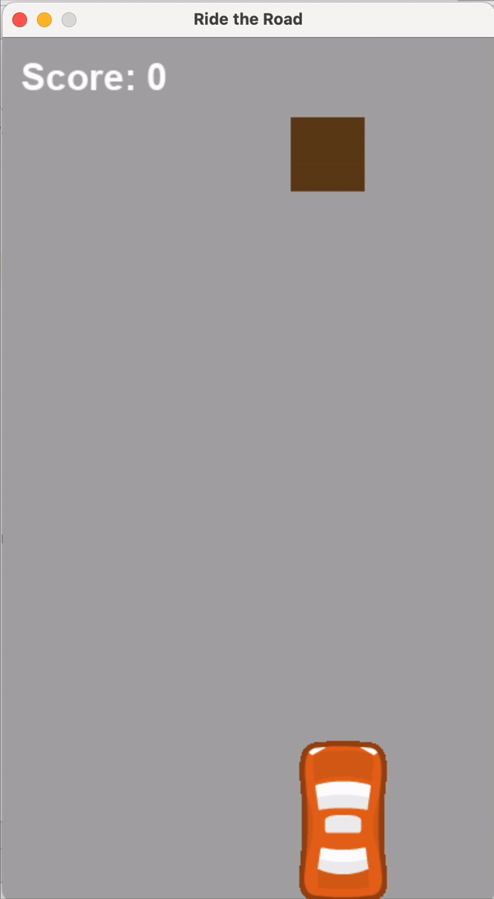
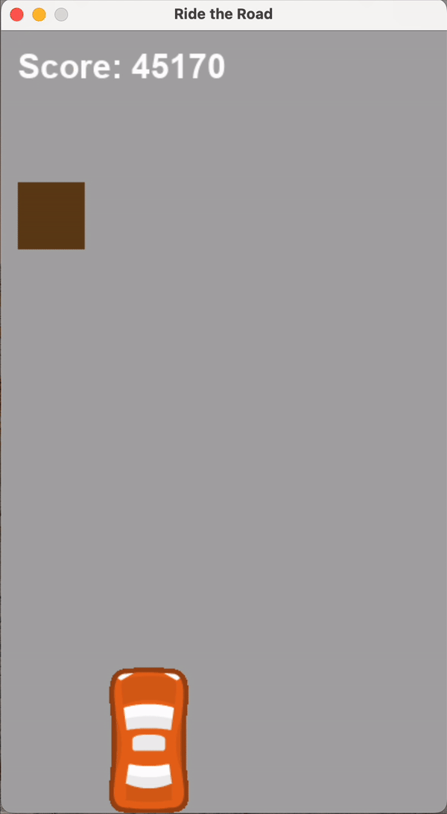

🚗 AI Car Game with Deep Q-Learning

This project implements a Deep Q-Learning (DQN) agent to play a simple car racing game, where the agent learns to avoid collisions by controlling the movement of a player-controlled car. The game is built using Pygame, and the AI is trained using PyTorch.

Gameplay Demonstration
* Initial Training Phase: In the early stages of training, the AI struggles to avoid obstacles and often crashes. You can see the learning process in action as the agent explores and gradually improves its performance.

* After Training (High Score): After several training iterations, the AI becomes proficient at avoiding obstacles and achieves a much higher score by making intelligent decisions.

AI Training:
* The agent is trained using a Deep Q-Network (DQN) with a neural network.
* It learns by interacting with the game, receiving rewards for avoiding collisions and penalties for crashing.
* The agent's model is trained using short-term and long-term memory:
    * Short-term memory is updated after each game step.
    * Long-term memory training is done using mini-batches of past experiences stored in a replay buffer.

Components:
* Game (Pygame):
    * A simple car racing game with obstacles (other cars) appearing randomly.
* Agent (DQN with PyTorch):
    * A reinforcement learning agent that observes the environment, chooses actions, and learns over time to optimize its score.
* Neural Network:
    * A feed-forward network with two hidden layers, responsible for approximating the Q-value function.

Key Files:
* game.py: Contains the Pygame-based car racing game logic.
* model.py: Defines the DQN model using PyTorch.
* agent.py: Contains the reinforcement learning agent with the Q-learning logic.
* plot.py: Utility to visualize the agent's training progress with scores over time.

Future Improvements:
* Implement more complex obstacles and dynamic traffic.
* Experiment with different neural network architectures and hyperparameters to further improve the agent's performance.
